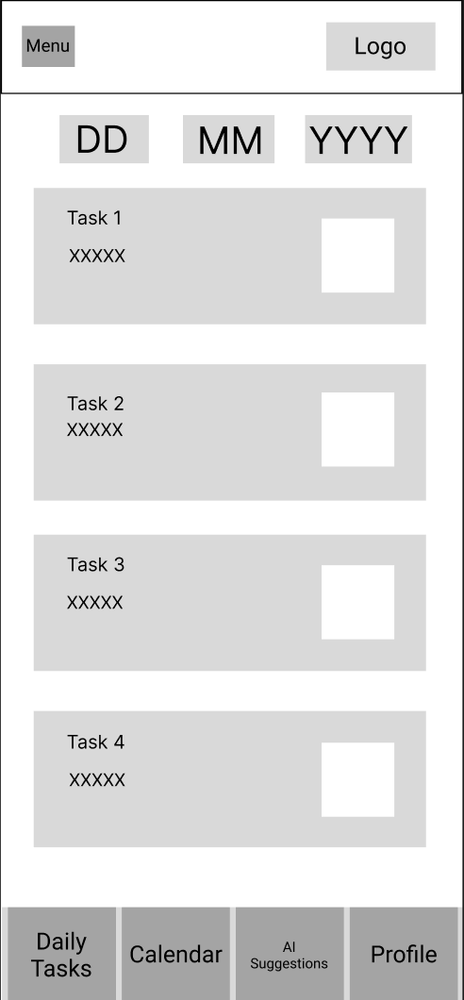

# User Experience Design

- [app map](https://drive.google.com/file/d/1PRT98SwQDq7Cg2TRRQ7L4PUbS1O74H0Z/view?usp=sharing)
- [wireframe](https://www.figma.com/design/PSvBhg3W6DRRxdASL4Bamq/Tasklatte?node-id=0-1&t=CjTC0cJKEBsTICyp-1)

---

## App Map Overview

Below is the **App Map Diagram**, which illustrates the overall navigation and relationships between key pages in the app.

### App Map Diagram
[App Map](ux-design/Task-Latte.drawio.png)

**Description:**  
This app map shows how users move through TaskLatte, starting from App Open, they can Log In or Register, then land on Home, which connects to all main features:

Calendar → view and manage Daily Tasks

Task List → Add or Edit Tasks

Suggestion → go to Settings for preferences

User Profile → check Goals and update info (e.g. Time-Zone, School, Major, Bio)

---

## Wireframe

Each page below represents a different screen or user interface component of the app.  

---

### 1. App Open Page

**Description:**  
This is the first page that the users meet when they open the app. The user can choose either log in or register through this page.

---

### 2. Log In Page

**Description:**  
This screen allows user to log in their own account.

---

### 3. Register Page

**Description:**  
This screen allows user to register an account.

---

### 4. Home Page

**Description:**  
The Home Page gives users a quick overview of their progress, showing daily and weekly task completion, motivational quotes, and productivity insights.

---

### 5. Calendar Page

**Description:**  
Shows all tasks organized by date, allowing users to view and add assignments easily.

---

### 6. Task List Page

**Description:**  
Lists all daily or upcoming tasks by date, enabling users to track and complete them systematically.

---

### 7. AI Suggestion Page

**Description:**  
Displays an optimized order of tasks and total estimated time, helping users plan their day efficiently.

---

### 8. Profile Page

**Description:**  
Lets users view and edit personal information, academic details, and long-term goals.

---

### 9. Daily Task Page

**Description:**  
Displays all tasks scheduled for a specific date, helping users track daily progress.

---

### 9. Add Task Page

**Description:**  
Allows users to create a new task by entering its title, details, course, due date, and priority level.

---

### 9. Edit Task Page

**Description:**  
Lets users update task details or delete an existing task to keep their schedule accurate.

---

### 10. Goals Page

**Description:**  
Allows users to view long-term goals with descriptions to track personal and academic aspirations.

---

### 11. Settings Page

**Description:**  
Lets users update profile information, manage account preferences, log out, or delete their account.

---

### 12. Change Goals Page

**Description:**  
Allows users to modify or add long-term goals to stay aligned with evolving objectives.

---

### 13. Change Bio Page

**Description:**  
Lets users edit and update their personal bio to reflect who they are or their current focus.

---

### 14. Change School Page

**Description:**  
Provides a simple form for users to edit their current school or institution details.

---

### 15. Change Major Page

**Description:**  
Enables users to update their academic major or field of study information.

---

### 15. Change Time-Zone Page

**Description:**  
Allows users to adjust their time zone settings to keep schedules accurate across regions.

## Notes

- All PNG diagrams should be placed in the `/ux-design/` directory.  

---
